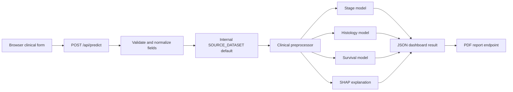
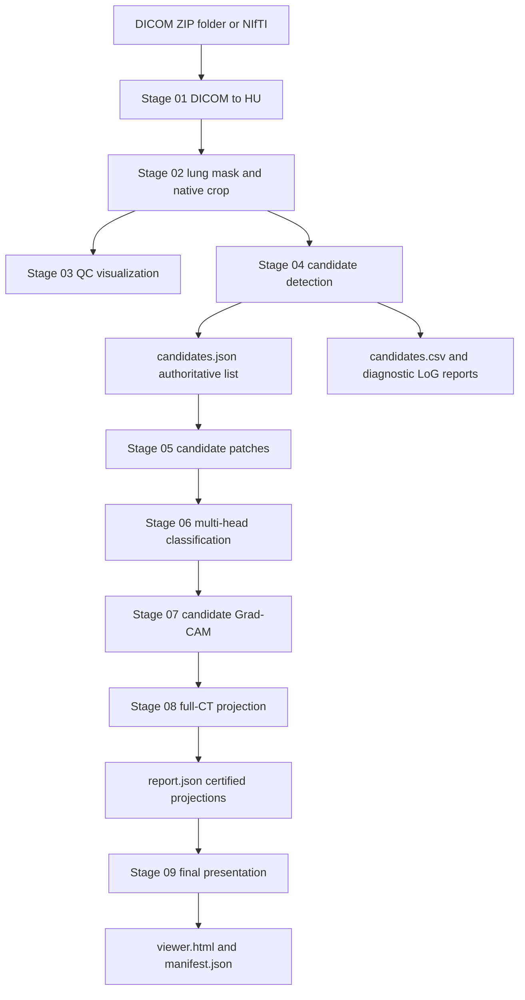

# LungInsight

LungInsight is an investigational multimodal lung-cancer decision-support prototype. It combines structured clinical data with CT imaging to produce:

- Clinical stage, histology, and survival predictions
- Imaging candidate detections and classifier outputs
- Candidate-local and full-CT Grad-CAM visualizations
- A self-contained Stage 09 CT viewer
- A downloadable PDF report

This software is not a medical device or a substitute for radiology, pathology, multidisciplinary review, or clinical judgment. Do not use real patient identifiers in a local development instance.

## Repository Layout

```text
LungInsight/
|-- Clinical/
|   |-- backend/app.py                 FastAPI application
|   |-- backend/pipeline.py            Clinical model adapter
|   |-- backend/pdf_generator.py       PDF report generator
|   |-- models/                        Fitted clinical artifacts
|   |-- static/js/app.js               Dashboard behavior
|   `-- templates/index.html            Dashboard UI
|-- Imaging/
|   |-- run_pipeline.py                Imaging stages 01-08
|   |-- 01_dicom_to_hu.py
|   |-- 02_mask_and_crop.py
|   |-- 03_visualize.py
|   |-- 04_detect_candidates.py
|   |-- 05_extract_candidate_patches.py
|   |-- 06_classify_candidates.py
|   |-- 07_visualize_gradcam.py
|   |-- 08_full_ct_gradcam.py
|   `-- 09_final_presentation.py       Final interactive CT viewer
|-- output/                            Generated case outputs
`-- .venv/                             Recommended Python environment
```

## Requirements

- Windows, macOS, or Linux
- Python 3.10 or newer
- A working virtual environment
- Sufficient disk space for CT volumes, intermediate arrays, and rendered images
- Optional NVIDIA GPU and compatible PyTorch installation for practical imaging runtimes

The clinical backend requires the packages in `Clinical/requirements.txt`. Imaging dependencies are listed in `Imaging/requirements.txt`. The clinical model files must be present in `Clinical/models/`, and the imaging checkpoint used by the selected stages must be present in `Imaging/checkpoints/`.

## Setup

From the repository root, create and activate a virtual environment:

```powershell
py -3 -m venv .venv
.\.venv\Scripts\Activate.ps1
```

Install the project dependencies:

```powershell
python -m pip install --upgrade pip
python -m pip install -r requirements.txt
```

If PowerShell blocks activation, run the commands with the virtual environment interpreter directly, for example `& .\.venv\Scripts\python.exe ...`.

## Run The Dashboard

Start the FastAPI application from the repository root:

```powershell
python -m uvicorn Clinical.backend.app:app --host 127.0.0.1 --port 8000 --reload
```

Open <http://127.0.0.1:8000> in a browser.

The dashboard accepts a clinical form plus one of these CT input forms:

- A DICOM file (`.dcm`)
- A ZIP archive of a DICOM series
- A TAR.GZ archive of a DICOM series
- A browser-selected DICOM folder
- NIfTI (`.nii` or `.nii.gz`) when supported by the configured imaging stages

For a CT submission, the backend stages the upload into a pipeline-compatible patient directory, runs Imaging stages 01-08, runs Stage 09, uses the Stage 04 candidate count as the imaging-derived tumor count, and embeds the resulting Stage 09 viewer in the dashboard.

## Run Imaging Only

The standalone imaging runner expects a patient directory below the DICOM root. With the bundled LIDC layout, run:

```powershell
python .\Imaging\run_pipeline.py 0141
```

The full identifier is also accepted:

```powershell
python .\Imaging\run_pipeline.py LIDC-IDRI-0141
```

Useful options:

```powershell
# Use CPU explicitly
python .\Imaging\run_pipeline.py 0141 --device cpu

# Use another DICOM root and output root
python .\Imaging\run_pipeline.py 0141 `
	--dicom-root .\path\to\dicom-root `
	--output-root .\output_regression

# Resume from an existing stage
python .\Imaging\run_pipeline.py 0141 --from-stage 7 --to-stage 8

# Skip the optional LoG diagnostic detector
python .\Imaging\run_pipeline.py 0141 --skip-log
```

The runner's default stage range is 01 through 08. Stage 09 is invoked explicitly by the Clinical upload bridge because it consumes the certified Stage 08 report and creates the final presentation artifact.

## Pipeline Architecture

### Clinical-only flow



`SOURCE_DATASET` remains an internal model-compatibility value because the fitted preprocessor expects that training-time feature. It is not exposed as a user input. `num_distinct_tumor_sites` is also not user-editable; when CT is submitted, Stage 04 supplies the value.

### Imaging flow



Stage 04 is a high-recall candidate detector. Its `candidates.json` output is the input authority for Stage 05. LoG output is diagnostic and is not merged back into the authoritative candidate list. Stage 08 is the projection authority; Stage 09 reuses its certified results to build the combined native-slice viewer.

### Dashboard multimodal flow

```mermaid
flowchart LR
		A[Clinical fields] --> C[/api/predict]
		B[CT upload] --> C
		C --> D[Stage 01-08 imaging pipeline]
		D --> E[Stage 04 nodule count]
		D --> F[Stage 09 viewer]
		E --> G[ClinicalPipeline.predict]
		A --> G
		G --> H[Stage, histology, survival, SHAP]
		F --> I[imaging.json mapping]
		I --> J[/api/ct/run_id/viewer]
		J --> K[Dashboard iframe]
		H --> L[Dashboard results and PDF]
```

## Output Layout

For a standalone run, output is written below `output/<patient-id>/`:

```text
output/
`-- LIDC-IDRI-0141/
		|-- 01/                       HU volume and metadata
		|-- 02/                       masked/cropped native CT volume
		|-- 04_candidates/             candidates.json and detection reports
		|-- 05_classifier_patches/     candidate-centered patches
		|-- 06_classification/         classifier predictions
		|-- 07_gradcam/                candidate-local Grad-CAM maps
		|-- 08_visualization/          full-CT projections and report.json
		`-- 09_presentation/           viewer.html and manifest.json
```

Clinical dashboard runs additionally use:

```text
output/
|-- <clinical-run-id>/
|   |-- upload/                   staged browser upload
|   `-- imaging.json              run-to-imaging-output mapping
`-- _imaging_inputs/<run-id>/     pipeline-compatible staged DICOM input
```

The dashboard viewer endpoint reads the Stage 09 path from that run-specific mapping rather than searching unrelated patient outputs.

## API Endpoints

| Method | Endpoint | Purpose |
| --- | --- | --- |
| `GET` | `/` | Dashboard |
| `GET` | `/api/health` | Backend and model load status |
| `GET` | `/api/sample` | Sample clinical values |
| `POST` | `/api/predict` | Clinical and optional CT inference |
| `GET` | `/api/ct/{run_id}/viewer` | Stage 09 HTML viewer |
| `POST` | `/api/report` | PDF report generation |

## Validation

Compile the backend modules:

```powershell
python -m py_compile `
	.\Clinical\backend\app.py `
	.\Clinical\backend\pipeline.py `
	.\Clinical\backend\pdf_generator.py
```

Check the Imaging runner help without processing a scan:

```powershell
python .\Imaging\run_pipeline.py --help
```

When the repository's Imaging test modules are available, run them from the Imaging directory:

```powershell
Set-Location .\Imaging
python -m unittest discover tests -v
Set-Location ..
```

## Troubleshooting

**The dashboard reports that clinical artifacts cannot be loaded.** Check that the required files are in `Clinical/models/`, then inspect `/api/health`.

**The CT upload is rejected.** Use a supported extension and ensure a browser folder upload contains actual files. Archives are extracted into a temporary, run-specific directory.

**Stage 04 cannot determine a nodule count.** Inspect `output/<patient-id>/04_candidates/candidates.json`. This file is the authoritative Stage 04 candidate list and should be present after a successful detector run.

**Stage 09 is missing.** Confirm that Stages 01-08 completed and that `08_visualization/report.json` exists. The standalone runner intentionally stops at Stage 08; the dashboard bridge invokes `09_final_presentation.py` afterward.

**Inference is too slow.** Use a CUDA-enabled PyTorch environment and select `--device cuda` where supported. For development, validate individual stages with `--from-stage` and `--to-stage` instead of repeating the complete pipeline.
